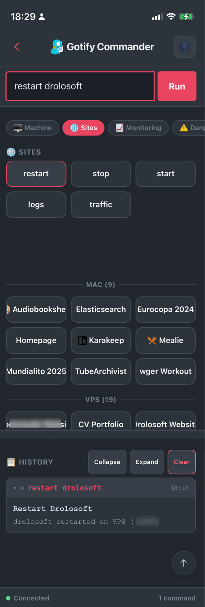
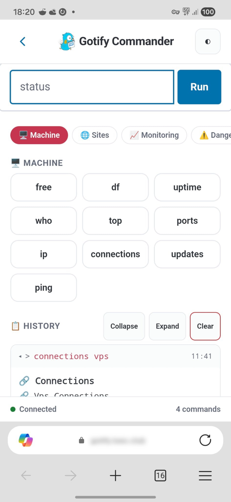
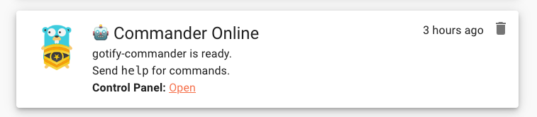
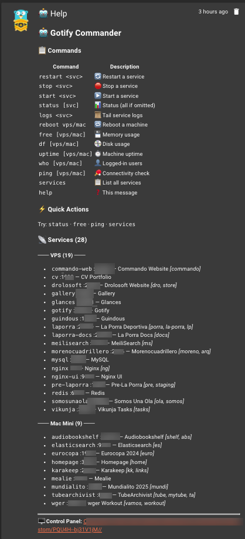
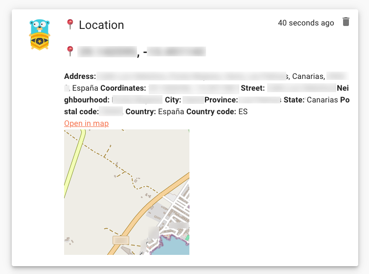
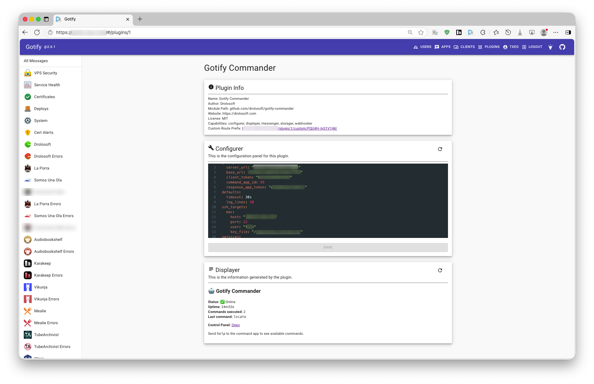

<p align="center"></p>

<h1 align="center">gotify-commander</h1>

<p align="center">
  <a href="https://go.dev"></a>
  <a href="https://gotify.net"></a>
  <a href="LICENSE"></a>
  <a href="https://github.com/drolosoft/gotify-commander/releases"></a>
</p>

> **A remote control for your servers.** The first Gotify plugin that talks back.

You're at a café. Your phone buzzes — a service is down. You tap `restart nginx`. Five seconds later: `✅ nginx restarted`.

No laptop. No SSH. No terminal. Just your phone and the Gotify app you already use.

23 commands. A visual control panel. Multi-machine support. One YAML config. Every other Gotify plugin forwards notifications somewhere else. This one lets you act on them.

<p align="center">
  
  &nbsp;&nbsp;
  
</p>

---

## How It Works

```
Phone (Gotify app)
      |
      |  "restart nginx"
      v
  Gotify Server  <------------------------------+
      |                                          |
      v                                          |
gotify-commander plugin                    Web UI (Pico CSS)
      |                                    browser dashboard
      +-- local: systemctl restart nginx   (VPS services)
      +-- SSH:   launchctl unload/load     (Mac services)
                            |
                            v
                      Response sent back
                            |
                            v
                  Phone notification
                  "Restart Nginx -- restarted on VPS (:80)"
```

Commands and responses flow through a **single unified Gotify app** — no separate channels to manage. Send a command, get the reply as the next notification.

---

## Quick Start

<p align="center"></p>

1. Download `gotify-commander-linux-amd64.so` from [Releases](../../releases)
2. Drop it in Gotify's plugin directory (usually `/opt/gotify/data/plugins/`)
3. Restart Gotify: `sudo systemctl restart gotify`
4. Open the Gotify WebUI -> **Plugins** -> **gotify-commander** -> **Configure** -> paste your YAML
5. Enable the plugin
6. Send `help` from the Gotify app on your phone

Access the web control panel at `https://your-gotify-domain/plugin/gotify-commander/`.

---

### Docker Installation

If you run Gotify in Docker, mount the plugin into the container:

```yaml
# docker-compose.yml
services:
  gotify:
    image: gotify/server:2.6.1
    volumes:
      - ./gotify-data:/app/data
      - ./gotify-commander-linux-amd64.so:/app/data/plugins/gotify-commander.so
    ports:
      - "2006:80"
```

Download `gotify-commander-linux-amd64.so` from [Releases](https://github.com/drolosoft/gotify-commander/releases) and place it next to your `docker-compose.yml`.

**Important:** The `.so` file must be compiled with the exact same Go version as your Gotify image. The pre-built binary is compiled against Gotify 2.6.1.

---

## Command Reference

<p align="center"></p>

### Service Management (7)

| Command | Args | Description |
|---------|------|-------------|
| `status` | `[service]` | Status of all services, or a specific one |
| `restart` | `<service>` | Restart a service (supports aliases) |
| `start` | `<service>` | Start a service |
| `stop` | `<service>` | Stop a service |
| `logs` | `<service>` | Tail the last N lines of service logs |
| `services` | -- | List all managed services |
| `help` | -- | Show command reference + control panel link |

### System Diagnostics (9)

| Command | Args | Description |
|---------|------|-------------|
| `free` | `[vps/mac]` | Memory usage |
| `df` | `[vps/mac]` | Disk usage (via duf) |
| `uptime` | `[vps/mac]` | System uptime + load average |
| `top` | `[vps/mac]` | Top processes by CPU/memory |
| `who` | `[vps/mac]` | Currently logged-in users |
| `ping` | `[vps/mac]` | Connectivity check |
| `ip` | `[vps/mac]` | IP addresses |
| `ports` | `[vps/mac]` | Listening ports |
| `connections` | `[vps/mac]` | Socket statistics |

### Monitoring & Analytics (4)

| Command | Args | Description |
|---------|------|-------------|
| `traffic` | `[service]` | Nginx traffic analysis via rhit (last 3 months) |
| `analytics` | -- | Web analytics summary via goaccess |
| `certs` | -- | SSL certificate expiry for all domains |
| `updates` | -- | Pending system updates (apt) |

### Location (1)

| Command | Args | Description |
|---------|------|-------------|
| `locate` | `<lat> <lon>` | GPS reverse geocoding via OpenStreetMap |

### Danger (2)

| Command | Args | Description |
|---------|------|-------------|
| `reboot` | `<vps/mac>` | Reboot a machine (requires explicit target) |
| `shutdown` | `<vps/mac>` | Shutdown a machine (requires explicit target) |

<p align="center"></p>

**Universal aliases:** `mem`/`memory` -> `free` -- `disk`/`space` -> `df` -- `log` -> `logs` -- `up` -> `uptime`

Typing just a service name (e.g. `nginx`) is treated as `status nginx`.

---

## Web UI Control Panel

<p align="center"></p>

A browser dashboard built with **Pico CSS** lives at `https://your-domain/plugin/gotify-commander/`.

- Live service status grid — all services, grouped by category, color-coded
- One-click restart / start / stop for any service
- Command history with timestamps and results
- System metrics (memory, disk, uptime) at a glance
- Dynamic favicons fetched from service domains
- Dynamic categories from your YAML config — no hardcoding

Access is secured through your existing Gotify login. No extra credentials.

---

## Configuration

Configure via Gotify WebUI — no config files to edit manually. See [`config.example.yaml`](config.example.yaml) for the full structure.

```yaml
gotify:
  server_url: "http://localhost:2006"
  base_url: "https://gotify.example.com"   # public URL for web UI links
  client_token: "your-client-token"        # from Gotify -> Clients
  command_app_id: 1                        # ID of the unified command/response app
  response_app_token: "your-token"         # token for the same app

defaults:
  timeout: 30s
  log_lines: 30

# Categories — tabs in the web UI
# type: machine (VPS/Mac buttons), service (service list), direct (runs immediately)
categories:
  - label: "🖥️ Machine"
    type: machine
    commands: [free, df, uptime, who, top, ports, ip, connections, updates, ping]
  - label: "🌐 Sites"
    type: service
    commands: [restart, stop, start, logs, traffic]
  - label: "📈 Monitoring"
    type: direct
    commands: [status, analytics, certs, services]
  - label: "⚠️ Danger"
    type: machine
    danger: true
    commands: [reboot, shutdown]

services:
  nginx:
    description: "Web Server"
    domain: "example.com"
    machine: vps
    port: 80
    aliases: [ng, web]
    systemd: nginx

  homeserver:
    description: "Home Server"
    machine: mac
    port: 8080
    aliases: [home]
    launchd: com.myapp.service
```

Required fields per machine type:
- `machine: vps` — requires `systemd` (unit name for `systemctl`)
- `machine: mac` — requires `launchd` (label for `launchctl`) + SSH target configured

### Getting Your Gotify Tokens

1. **client_token**: Go to Gotify WebUI → **Clients** → Create a new client → copy the token
2. **command_app_id**: The plugin creates its own app (ID shown in Plugins page). Set this to that app's ID for unified commands + responses
3. **response_app_token**: Not used in unified mode — can be any valid app token

---

## Categories

Categories define the tabs in the web UI control panel. Each has a `type` that controls the interaction:

| Category | Typical services |
|----------|-----------------|
| `web` | nginx, caddy, traefik |
| `media` | Jellyfin, TubeArchivist, Plex |
| `monitoring` | Grafana, Prometheus, Uptime Kuma |
| `data` | PostgreSQL, Redis, Meilisearch |
| `automation` | n8n, Home Assistant, cron jobs |
| `system` | SSH daemon, Fail2ban, Gotify itself |

Categories drive both the `services` command output and the web UI grouping. Add your own by extending the `categories` section.

---

## Multi-Machine

gotify-commander supports two machine types out of the box:

**VPS** — commands run locally on the same server where Gotify is installed. Uses `systemctl` for service management.

**Mac** — commands are sent over SSH to a remote Mac Mini or MacBook. Uses `launchctl` for service management.

```yaml
ssh_targets:
  mac:                            # must be named "mac" to auto-wire
    host: "100.x.x.x"            # Tailscale IP recommended
    port: 22
    user: "admin"
    key_file: "/home/admin/.ssh/id_rsa"
```

Once configured, `free mac`, `df mac`, `uptime mac`, and services with `machine: mac` all route through SSH automatically.

---

## Security

**gotify-commander executes real system commands on your server.** Treat it with the same caution as SSH access.

### Who Can Trigger Commands

- **Anyone who can send a message to the configured Gotify app** can execute commands. This includes Gotify users with access to that application, or anyone who obtains a valid app token.
- **The web control panel** serves its HTML page without authentication. The API endpoints (`/execute`, `/health`, `/config`) are protected by `web_password` if configured — **but it is not set by default**. Without it, anyone who can reach your Gotify server can execute commands through the web UI.

### What Can Be Executed

- Only the **23 registered commands** can run. No arbitrary command execution.
- Service names are validated against `^[a-zA-Z0-9][a-zA-Z0-9._-]*$` and must match your configured whitelist.
- Most commands use `exec.Command` (no shell). However, **four commands use `bash -c`**: `certs`, `traffic`, `analytics`, and `locate`. User input reaching these shells is validated (alphanumeric for service names, numeric-only for GPS coordinates), but a shell is invoked.
- The plugin runs with the same permissions as the Gotify process.

### What Gets Exposed

- Command output (process lists, memory usage, IP addresses, open ports, SSL cert details) flows back as Gotify notifications visible to anyone who can read that app's messages.
- The `locate` command sends GPS coordinates to the [OpenStreetMap Nominatim API](https://nominatim.org/) for reverse geocoding — your coordinates are sent to a third-party service.
- The web UI `/config` endpoint exposes your service list, ports, and machine names.

### Hardening Recommendations

1. **Run Gotify behind a VPN** (Tailscale, WireGuard). Do not expose Gotify to the public internet. This is the single most important security measure.
2. **Set a strong Gotify admin password.**
3. **Set `web_password`** in your config to protect the web control panel.
4. **Use HTTPS** for all Gotify traffic.
5. **Restrict Gotify app tokens.** Only create tokens for devices you control.

### Defense Layers

| Layer | Status |
|-------|--------|
| Command whitelist (23 commands) | ✅ Enforced |
| Input sanitization (regex) | ✅ Enforced |
| Service name whitelist | ✅ Enforced |
| Execution timeouts (30s default) | ✅ Enforced |
| Gotify authentication | ✅ Enforced (Gotify's own auth) |
| Web UI API authentication | ⚠️ Optional (`web_password`, off by default) |
| Rate limiting | ❌ Not implemented |
| Per-command authorization | ❌ Not implemented |
| SSH host key verification | ❌ Disabled (`InsecureIgnoreHostKey`) |

---

## Comparison

| Feature | gotify-commander | Telegram Bots | Uptime Kuma |
|---------|:---:|:---:|:---:|
| Self-hosted | Yes | No | Yes |
| Bidirectional | Yes | Yes | No |
| Runs inside Gotify | Yes | No | No |
| No third-party services | Yes | No | Yes |
| Service management | Yes | varies | No |
| Multi-machine (SSH) | Yes | varies | No |
| Web control panel | Yes | No | Yes |
| Traffic & analytics | Yes | No | No |
| GPS locate | Yes | No | No |
| Tailscale security | Yes | No | No |
| Phone app already installed | Yes | Yes | No |

---


## External Dependencies

Some commands rely on utilities installed on the server. The plugin works without them, but those specific commands will fail.

| Command | Requires | Install | Notes |
|---------|----------|---------|-------|
| `df` | [duf](https://github.com/mdu-perrone/duf) | `apt install duf` | Required — command fails if not installed |
| `traffic` | [rhit](https://github.com/Canop/rhit) | Download from [releases](https://github.com/Canop/rhit/releases) | Nginx log analyzer |
| `analytics` | [goaccess](https://goaccess.io/) | `apt install goaccess` | Web analytics from nginx logs |
| `analytics` | `python3` | Pre-installed on most distros | Parses goaccess CSV output |
| `locate` | `python3` + `curl` | Pre-installed on most distros | Reverse geocoding via Nominatim |
| `certs` | `openssl` | Pre-installed on most distros | Reads Let's Encrypt certificates |
| `ports` | `ss` | Part of `iproute2` | Socket statistics |
| `top` | `ps` | Part of `procps` | Process listing |

All other commands use standard Linux utilities (`systemctl`, `free`, `uptime`, `who`, `hostname`, `journalctl`).

## Building from Source

The plugin must be built on Linux with `CGO_ENABLED=1` (Go plugins require cgo).

```bash
git clone https://github.com/drolosoft/gotify-commander
cd gotify-commander
go build -buildmode=plugin -o gotify-commander.so .
sudo cp gotify-commander.so /opt/gotify/data/plugins/
sudo systemctl restart gotify
```

**Using the Makefile:**

```bash
make test          # run unit tests
make lint          # go vet
make deploy        # SSH -> build on VPS -> install -> restart Gotify
make deploy-dev    # fast deploy, skip tests
```

The `deploy` target connects to your VPS via Tailscale, pulls the latest commit, builds in place, copies the `.so`, and restarts Gotify in one step.

---

## Contributing

Contributions are welcome — bug fixes, new commands, feature ideas. Open an issue or submit a PR.

If gotify-commander made your server management easier, consider giving it a star on GitHub — it helps others discover the project.

---

## Support

If gotify-commander gives you superpowers over your infrastructure, consider buying me a coffee — it keeps the next one coming!

<p align="center">
<a href="https://buymeacoffee.com/juan.andres.morenorub.io"></a>
</p>

---

## License

**MIT License** — free to use, modify, and distribute.

**[Drolosoft](https://drolosoft.com)** -- *Tools we wish existed*
